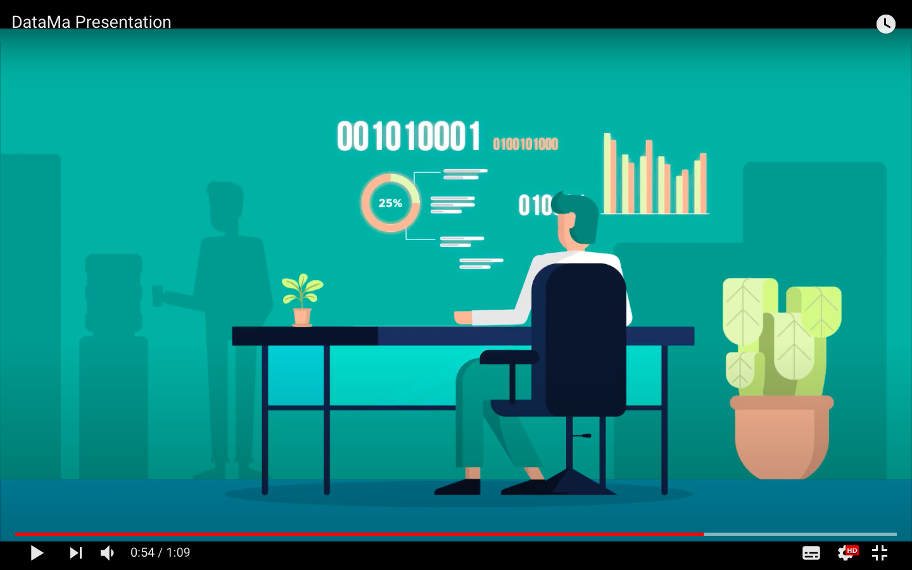

-------------

 <h1> Smart analytics. Documented  <h1> 

-------------

## Documentation

1. [DataMa Compare](compare/compare.md)
2. [DataMa Pivot](pivot/pivot.md)
3. [DataMa Impact](impact/impact.md)
4. [DataMa Journey](journey/journey.md)

## Understand DataMa in Motion !

[Stay in touch with us](https://datama.fr/lets-talk/), if you have any issue, or proposition to improve the solution. We would love to talk with you!

## Release

Keep an eye on the [new](news.md) features.
