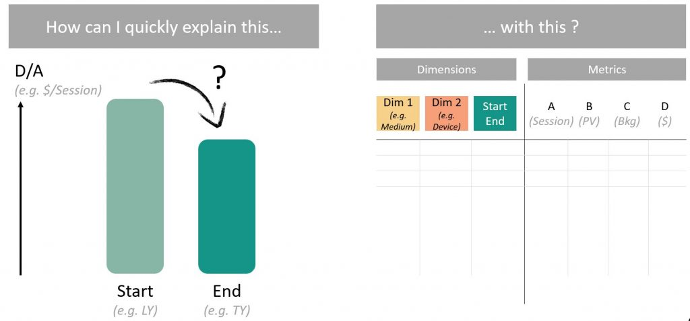

# DataMa Compare

> **DataMa COMPARE is a data analysis tool that allows you to quickly identify and understand the factors that cause your performance indicators to rise or fall.**

DataMa COMPARE makes it easy to explain variations of any KPI between two segments.

This documentation gives you an overview of how it works and how to use it.

Below is a video of the main functionnalities of DataMa Compare:

<iframe width="800" height="450" src="https://www.youtube.com/embed/SfPdIoKUFdQ" frameborder="0" allow="accelerometer; autoplay; encrypted-media; gyroscope; picture-in-picture" allowfullscreen></iframe>

## What we are trying to answer?

This analysis is possible thanks to **2 main types** of data collected from your business:

* **Business Metrics data of the company** (revenue, sales volume, number of users impacted by a marketing campaign, etc.)
* and the **dimensions associated** with these volumes (customer segment, type of product sold, country, vendors, age, gender, device, year, models, …)

Its data comes from management ERP, Excel spreadsheet or even **data collection tools** (like Google Analytics, ContentSquare, …)

---------------------

Follow this [link](https://datama.fr/wp-content/uploads/2019/02/DataMaCompare_BrochureEN_2019.pdf), to get access to a more commercial presentation.

Hope you enjoy it.

Please visit DataMa generic [website](https://datama.fr/lets-talk/) for any other question and to hesitate to reach us if you have any question about the solution, your analysis or the documentation. We will be more than happy to get your point of view.
