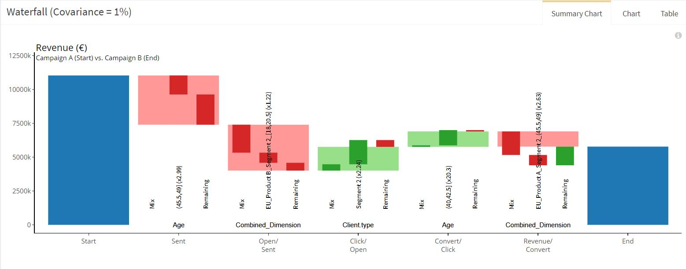

# Marketing Campaign – Continuous dimension

> Find below information about the **« Marketing Campaign – Continous dimension»**  example in our [demo](https://solutions.datama.fr/app/DataMa_analyse_beta) solution.

Read our [article](https://datama.fr/fr/2019/04/11/comment-analyser-lefficacite-dune-campagne-demailing-2/) to better understand emailing campaign analysis.

As presented in the data, one of the dimension is a continuous dimension. This dimension wil be clustered by the algorithm to gathered people around the same age with a similar behaviour. In that case : 18-20.5 >> 20.5 – 23>> 23-25 >>25-36.5….

This could be done whatever the continuous dimension represents.

Below is an extract of the data that has been used for this example. You can download the source: [Gsheet](https://docs.google.com/spreadsheets/d/1bNEeqm5CfpPmYPr_t4ff1xcJkSBKoVvwJd4vKB0sDzs/edit#gid=643112391)

<iframe width=860 height=500 src="https://docs.google.com/spreadsheets/d/e/2PACX-1vTXRV_yX735skN1XO80vxldchFr5tii0E1mUgk0vdkaZaOGDxHY9yVZEk0wXb1zag0OVIQzxRBm1zuw/pubhtml?gid=643112391&amp;single=true&amp;widget=true&amp;headers=false"></iframe>
