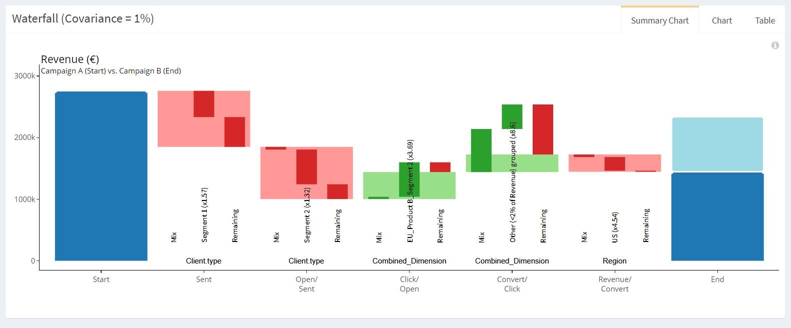

# Marketing Campaign – Scope

> Find below information about the **« Marketing Campaign – Scope»**  example in our [demo](https://solutions.datama.fr/app/DataMa_analyse_beta) solution.

Read our [article](https://datama.fr/fr/2019/04/11/comment-analyser-lefficacite-dune-campagne-demailing-2/) to better understand emailing campaign analysis.

As presented in the data, a column called « Scope » allows to remove part of the data in the analyse but still consider this amount in the total (dark blue and light blue). The waterfall assessment will not consider the out of scope data.

This is helpful to compare your business all things being equal.

Below is an extract of the data that has been used for this example. You can download the source: [Gsheet](https://docs.google.com/spreadsheets/d/1bNEeqm5CfpPmYPr_t4ff1xcJkSBKoVvwJd4vKB0sDzs/edit#gid=1172240978)

<iframe width=860 height=500 src="https://docs.google.com/spreadsheets/d/e/2PACX-1vTXRV_yX735skN1XO80vxldchFr5tii0E1mUgk0vdkaZaOGDxHY9yVZEk0wXb1zag0OVIQzxRBm1zuw/pubhtml?gid=1172240978&amp;single=true&amp;widget=true&amp;headers=false"></iframe>
