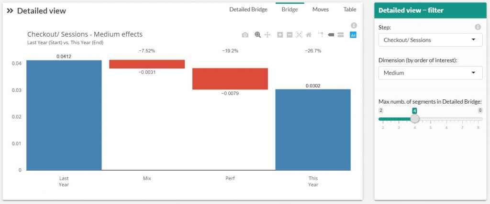

# Bridge

For the selected step and dimension this graph shows the Mix effect and the performance effect.  This allow you to understand the impact of the evolution of the distribution in input (Mix) and the real impact of the performance (Perf)

* **The percentage** is the evolution of the Mix and the Performance effect between Start and End dimension. (e.g.: evolution between last month and current month)
* **The unit** used for this graph is real unit of the step (e.g. in the picture above, we selected the Checkout/ Sessions step which is our unit for this graph. The mix effect has a negative impact of -0.003 Checkout/ Sessions)
