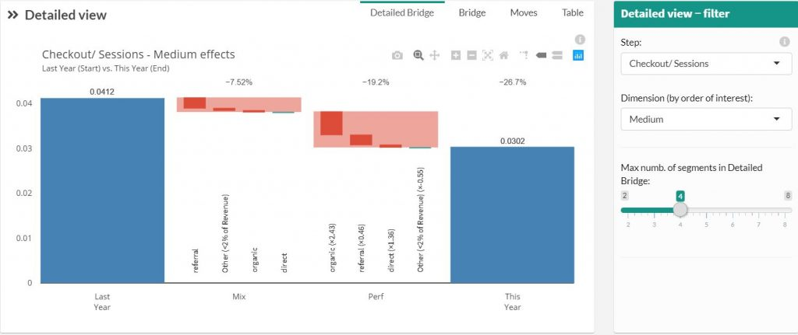

# Detailed Bridge

Play with this graph by using both Step and dimensions drop-down menus.

For a selected step, this graph shows the main Mix effect and Performance effect of the selected dimension.  This allow you to order the importance of each dimension.

### Acceleration of rise or fall (x2.43)

The figure in parenthesis explains the acceleration this element has compare to the other element in the dimension. « The fall of the referral traffic goes 2.43 times faster than the other type of medium traffic ».

If this figure is close to 1, this will say that the element you’re looking has the same rise or fall than the other element in the dimension. This will tell you that everything is rising or falling at this step and nothing in your dataset explain why this step is positive or negative. You should add some more dimension to explain this variation (weather, holidays, day-off, bank holidays, strike, price versus competition, …)
