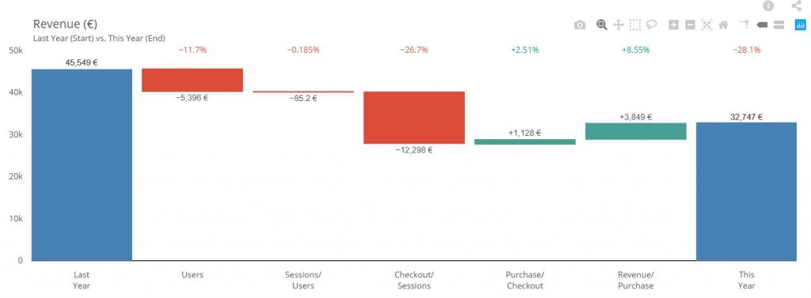

# Waterfall

Waterfall is a group of 3 tabs. See below articles for details on each tab:

* [Chart](compare/web_application/dashboard/chart.md)
    * [Zoomed View](compare/web_application/dashboard/zoomed_view.md)
* [Summary Chart](compare/web_application/dashboard/summary_chart.md)
* [Funnel](compare/web_application/dashboard/funnel.md)

## Covariance

A Covariance ratio appears on the top left of the waterfall.

(See more details regarding [Covariance](compare/model/covariance.md))

!> A ‘!’ will appear when covariance is above 30%. This intends to remind you that covariance is relatively high, hence you need to be careful with the results you’re having, and potentially reduce the number of steps or dimensions to reduce covariance
