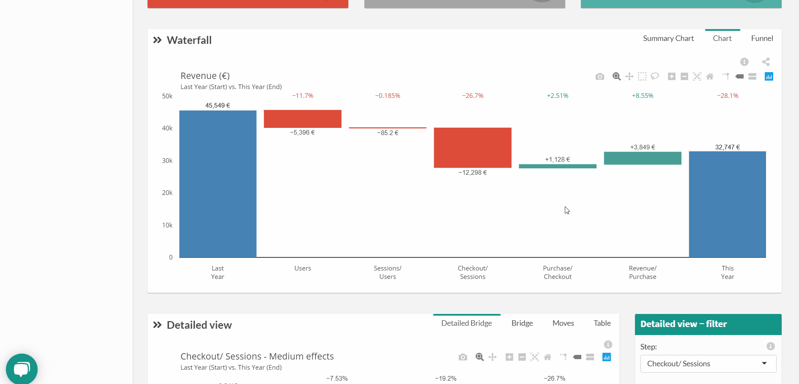

# Skipped steps

Skipped steps (selected): the steps that are kept within your overall [Metric Relation](general/admin/input/metric_relation.md) definition. This allows you to change your overall « Market Equation » and the KPI you’re following, as well as grouping/ expanding the steps you’ve defined

1. Click on the drop-down arrow to display the settings menu

2. Select one or several steps you want to skip

3. Click on « Compare » to get results

Selected steps are no more displayed in the chart

