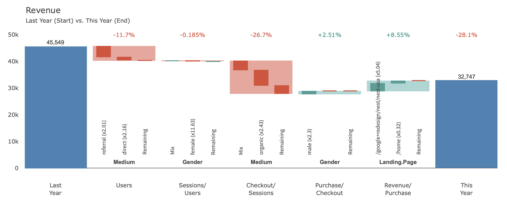

# Marketing Campaign

> This page details the **« Marketing – Campaign »**  example in our [demo](https://solutions.datama.fr/) solution.

Read our [article](https://datama.fr/fr/2019/04/11/comment-analyser-lefficacite-dune-campagne-demailing-2/) to better understand emailing campaign analysis

This use case is a basic example of a conversion funnel used for an email campaign. In this use case, DataMa Compare will compare 2 different campaigns and identify the performance at each step of the two campaigns to understand the cause of variation between the two.

**For example:** At this step : the performance of number of emails « Open/Sent » collapsed mainly due to Segment 2, which opened fewer emails in Campaign B than in Campaign A. (This can be seen from the red bar in the middle)

Below is an extract of the data that has been used for this example. You can download the source here: [Gsheet](https://docs.google.com/spreadsheets/d/1bNEeqm5CfpPmYPr_t4ff1xcJkSBKoVvwJd4vKB0sDzs/edit#gid=1286768317)

<iframe src="https://docs.google.com/spreadsheets/d/e/2PACX-1vTXYphkUS8WX6Wa4GZp5LBisnEOoqdLyp9darrXuIJPqmsnv_f8Tvhq_0sNX7L2uVfIaJjonTP2j8Fm/pubhtml?gid=1286768317&amp;single=true&amp;widget=true&amp;headers=false" width="920" height="440"></iframe>

The 2 other Marketing examples represent specific features available in our DataMa Compare solution (clustering of continuous dimensions, and the ability to put some of the data aside – scope in / scope out):
* [Marketing Campaign – Continuous dimensions](home/use_cases/marketing_continuous.md)
* [Marketing Campaign – Scope](home/use_cases/marketing_scope.md)
