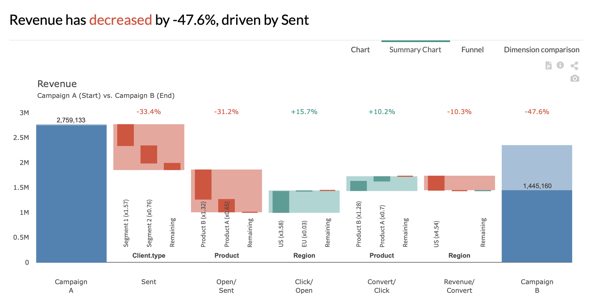

# Marketing Campaign – Scope

> This page details the **« Marketing Campaign – Scope»**  example in our [demo](https://solutions.Datama.fr/) solution.

Read our [article](https://Datama.fr/fr/2019/04/11/comment-analyser-lefficacite-dune-campagne-demailing-2/) to better understand emailing campaign analysis.

As presented in the data, a column called « Scope » allows us to remove part of the data in the analysis, but still consider this amount in the total (dark blue and light blue blocks). The waterfall assessment will not consider the out-of-scope data.

This is helpful to compare your business, considering all else equal.

Below is an extract of the data that has been used for this example. You can download the source here: [Gsheet](https://docs.google.com/spreadsheets/d/1bNEeqm5CfpPmYPr_t4ff1xcJkSBKoVvwJd4vKB0sDzs/edit#gid=1172240978)

<iframe src="https://docs.google.com/spreadsheets/d/e/2PACX-1vTXYphkUS8WX6Wa4GZp5LBisnEOoqdLyp9darrXuIJPqmsnv_f8Tvhq_0sNX7L2uVfIaJjonTP2j8Fm/pubhtml?gid=1172240978&amp;single=true&amp;widget=true&amp;headers=false" width="860" height="500"></iframe>
