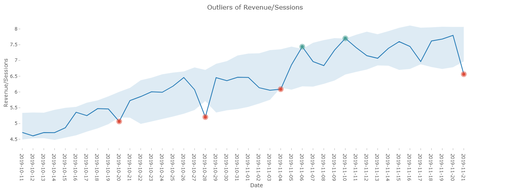
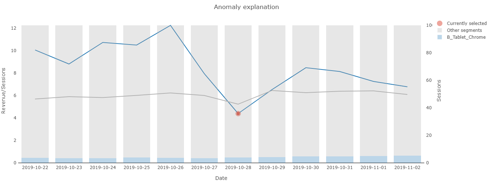

> **Anomaly Detection allows you not only to detect potential outliers in your dataset but also to explain them using Datama Compare algorithm.**

You can enable Anomaly Detection by switching the 'Anomaly Detection' toggle in the menu.

If your dataset is big enough, Anomaly Detection will show you potential outliers as well as giving you the opportunity to further investigate your data. You can also adjust how sensitive you want the detection to be using the "Confidence interval" slider in the settings.

By default, the most interesting outlier is selected but you can also choose any point in your dataset that you would like to get insight for. This can be done by selecting it or directly by clicking the graph.

