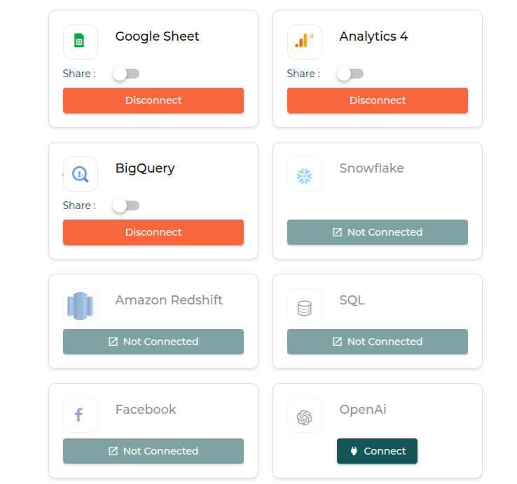

 

> When using OpenAi to improve your insight, you are using the basic version of OpenAi. If you want to use your own credentials, this section is for you

 

# 1. How to use your own credentials

To connect to your Open Ai Credentials, it's simple you will need your OpenAi API Key.

 

# 2. Where do I find my OpenAI API Key?

You can find your Secret API key [on the API key page](https://platform.openai.com/api-keys).
It'll have this form `sk-...XxZX`
Check out their [Best Practices for API Key Safety](https://help.openai.com/en/articles/5112595-best-practices-for-api-key-safety) to learn how you can keep your API key protected.

<strong>Reminder</strong> : Do NOT share you API key with anyone!

 

# 3. What Do I do with it ?
Add the OpenAi credential to your credentials page by clicking on the "Connect" button for OpenAi

<h3>That's it !</h3>

Now whenever you are using OpenAi, it'll use the given credential.
If you have the option, you can also use to share that credential to your organization and they'll 
automatically use that credential for users in the organization
 

To use this service, you'll need to accept OpenAi [Terms and conditions](https://openai.com/policies/)

 