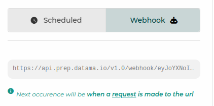

 

> **This section helps you automatise the export of your analysis**

# 1. Trigger exports with webhooks or time based exports

## 1.1. What are webhooks ?
Webhooks are a way for one application to send information to our application automatically when something happens.
Think of it as a notification system, but instead of sending a message to a person, it sends data to another system.
Creating an incoming webhook gives you a unique URL to which you send a request.

### 1.1.1. How to use webhooks ?
It's simple, when exporting, just select webhooks, and then you configure your exports, and copy the given url
When making an HTTP GET request to that URL, it'll automatically trigger the job.

In order to understand how to send Datama notifications by webhook via an orchestrator? Read our [article](https://datama.io/how-to-send-datama-notifications-by-webhook-via-an-orchestrator-ga4-bq-gcp-example/)!

## 1.2. What are time-based exports ?

Time based exports are a way for your flow to be run at a given time (which is different from webhooks that run _WHEN_ a
request is made on the given url)
By default, exports are time based and you can select the scheduled time.
 

# 2. Exports
 

You don’t have time to open the Datama interface … receive your analyses directly in your mailbox or on a Slack channel
By using the menu “export result” you can schedule an export directly to a mailbox at the frequency you want.

Here's what it's going like to be in Datama Prep:

 



 

but you can also access the export menu within each solution.

Here are the available connectors to extract your analysis:
- [Slack](#21-slack)
- [Email](#23-email)
- [Static URL](#24-static-url)
- [Teams](#23-email)

 

## 2.1. Slack

- connect your slack account
- To sync your export with the data's update, activate the <i>"Sync with flow scheduler"</i> (a Scheduler need to be set in the menu Data > Schedule)
- Specify the frequency you want to receive your message (this setting is deactivated when the export is sync with a flow scheduler).
- Select <i>Send on Alert only</i> if you only want to receive the analysis when you KPIs reached a certain [threshold]({{site.url}}/{{site.baseurl}}/core_app/new/prep/interface/threshold.html")
- Arrange your extraction depending on your needs :
    - **Slides**: Each slide is coming with title + graph + comment (except alert wich is just a message). <i>Bridge</i> is representing the detail on the step with the main variation.
    - **List**: Give you the ability to select at a lower lever the detail you want to display in your message.
    - **Dropdown**: see only one graph and select with a drowdown the graph or the comment to display

 

## 2.2. Teams

- connect your Teams account
- Specify the frequency you want to receive your message (this setting is deactivated when the export is sync with a flow scheduler).
- Choose a team from the teams you joined. Then you may choose a channel in which the export will be sent.
- Select <i>Send on Alert only</i> if you only want to receive the analysis when you KPIs reached a certain [threshold]({{site.url}}/{{site.baseurl}}/core_app/new/prep/interface/threshold.html")
- Arrange your extraction depending on your needs :
    - **Slides**: Each slide is coming with title + graph + comment (except alert wich is just a message). <i>Bridge</i> is representing the detail on the step with the main variation.
    - **List**: Give you the ability to select at a lower lever the detail you want to display in your message.
    - **Dropdown**: see only one graph and select with a drowdown the graph or the comment to display

 

## 2.3. Email

- To sync your export with the data's update, activate the <i>"Sync with flow scheduler"</i> (a Scheduler need to be set in the menu Data > Schedule)
- Enter one or more email addresses by selecting "Enter" between each address,
- Specify the frequency you want to receive your message (this setting is deactivated when the export is sync with a flow scheduler).
- Select <i>Send on Alert only</i> if you only want to receive the analysis when you KPIs reached a certain [threshold]({{site.url}}/{{site.baseurl}}/core_app/new/prep/interface/threshold.html")
- Arrange your extraction depending on your needs :
    - **Slides**: Each slide is coming with title + graph + comment (except alert wich is just a message). <i>Bridge</i> is representing the detail on the step with the main variation.
    - **List**: Give you the ability to select at a lower lever the detail you want to display in your message.
    - **Dropdown**: see only one graph and select with a drowdown the graph or the comment to display

    

 

## 2.4. Static URL

This extraction allows to create URL accessible to every user without login to Datama.

Activate <i>Public URL</i> to make the URL accessible to user without login to the Datama account, when deactivated user will need to be logged-in.

- Arrange your extraction depending on your needs :
    - **Slides**: Each slide is coming with title + graph + comment (except alert wich is just a message). <i>Bridge</i> is representing the detail on the step with the main variation.
    - **List**: Give you the ability to select at a lower lever the detail you want to display in your message.
    - **Dropdown**: see only one graph and select with a drowdown the graph or the comment to display

 

Export part or full view of the solution : "alert message", "Waterfall" or "Detailed step view".

Your graph wil be updated according to your data. As soon as you load the URL the graph will be updated with the freshest data.

 
