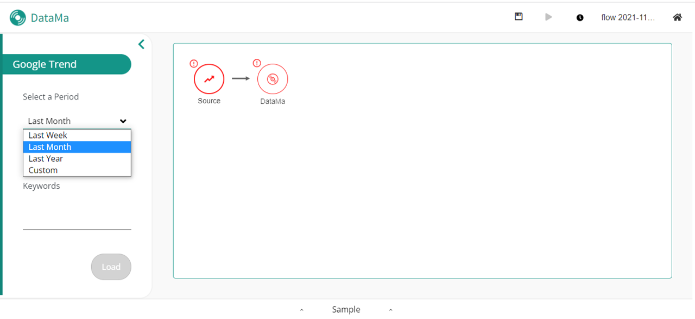
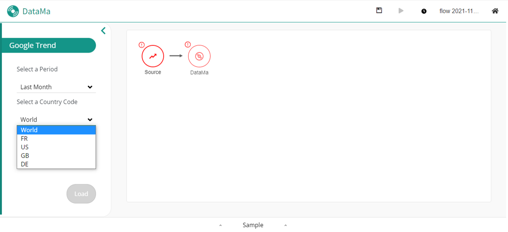

> **Google Trend is most of the time a dataset that needs to be appended with another dataset.**

**With DataMa Prep add value to your dataset**

Our tools allow you to enrich your local data with external data like Google Trend and others. Allowing you to understand all your kpi variation

With Google Trend connector, you can enrich your data flow with Google Search result in a given date range

#### You can cross your data with Google trends data

### Choose the period of time you want to focus on:

As you can see, you can customize your choice and adapt it to the period you want.

### Select the country concerned by this trend (France, US, GB or Germany):

### Last step is to enter your keywords, the ones you want to have the Google trend from

It will enrich your analysis by comparing your own data of your e-commerce website or marketing campaign results with the data and trends of the market. You will be able to compare your evolution with a larger point of view and understand your performance in a more global context.

To understand better the tool "Append", click [here]({{site.url}}/{{site.baseurl}}/core_app/prep/sidebar/actions/Append.html)
