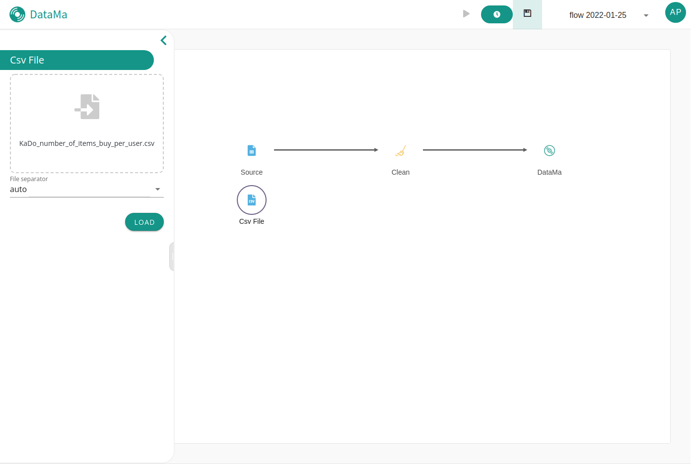

**You can plug your CSV files in DataMa PREP.**

All you need to do is drag and drop your CSV file in the box. You can choose your CSV separator character to correspond to your data file
When your upload complete, click on the Load button to load DataMa Prep Sample and start to use your data as a flow !