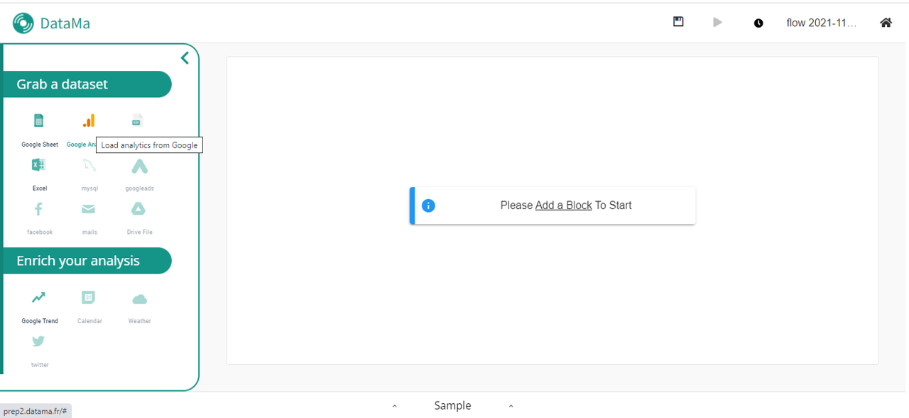
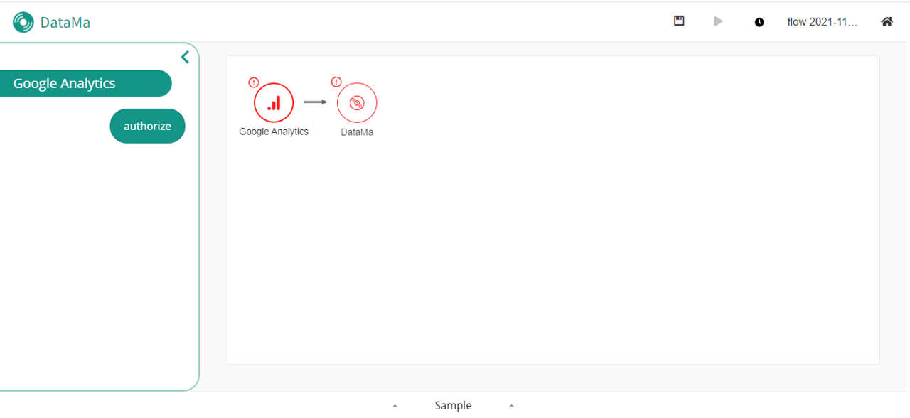
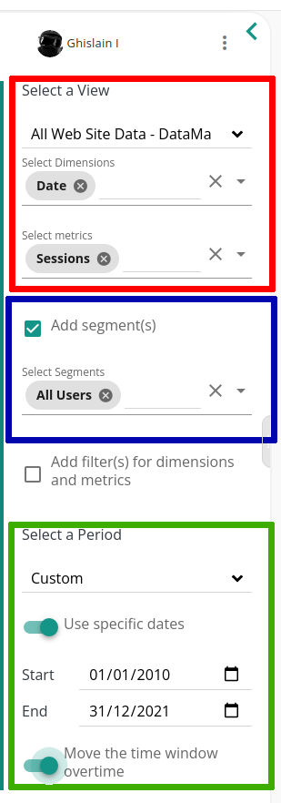

> **You can upload your Google Analytics datasets in DataMa PREP.**

 

## Instructions

Click on the GA icon to upload your document:

You might need to give authorization to your google analytics.

To do so, login to your GA Account by pressing the authorize button

You can configure your GA report with the sidebar inputs. See image bellow

 

### Views Metrics and dimensions
Select your view, metrics and dimensions with the first block (in red). You can choose only one view and as many metrics and dimensions you want.

 

### Segment definition

#### About segments [(from google docs)](https://support.google.com/analytics/answer/3123951?hl=en#zippy=%2Ccet-article-aborde-les-points-suivants%2Cin-this-article)

A segment is a subset of your Analytics data. For example, of your entire set of users, one segment might be users from a particular country or city. Another segment might be users who purchase a particular line of products or who visit a specific part of your site.

Segments let you isolate and analyze those subsets of data so you can examine and respond to the component trends in your business. For example, if you find that users from a particular geographic region are no longer purchasing a line of products in the same volume as they normally have, you can see whether a competing business is offering the same types of products at lower prices. If that turned out to be the case, you could respond by offering a loyalty discount to those users that undercuts your competitor's prices.

You can also use segments as the basis for audiences. For example, you might create a segment of users who visit your menswear pages, and then target just those users (your audience) with a remarketing campaign that is focused on the new items that you are adding to those pages.

 

#### Using segments
**It is not mandatory** to add segments to your report.
Just check the "Add segment(s)". You can **add up to 4 segments**

 

#### Timeframe selection

Select wether you want a relative date, or absolute. If you want to lock your timeframe selection, uncheck the "move the time window overtime"
