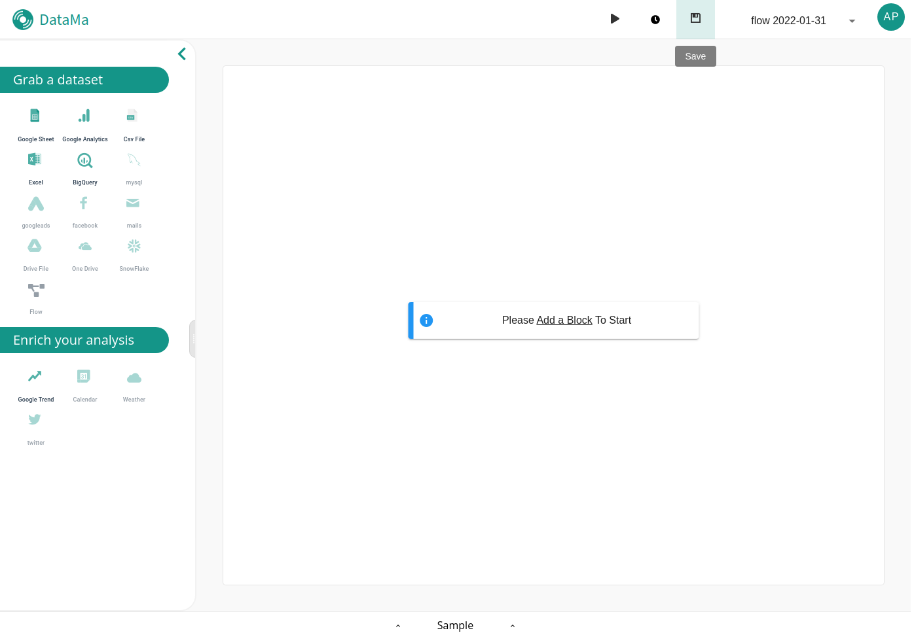
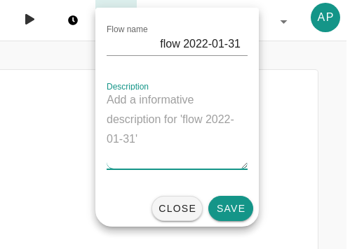

> **Find information about how to save your flow**

 

After setting your flow you will need to save it in order to launch DataMa Core.

To do it, click on the save button of DataMa Prep header section, a dropdown appear and allow you to set your flow's title & description.

when closing the dropdown menu by clicking "save" your flow configuration is send to our server to save it into our database.