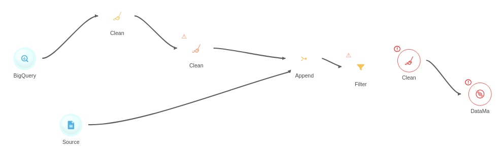

## Elements

The flow is composed of 
  - Source Blocks
  - Action blocks
  - Arrow linking the blocs

### Cache bubble on source blocs
On source blocks, there is often a blue background like a water droplet, depicting that those blocs are [cached](https://en.wiktionary.org/wiki/cache#en) (to make it faster).

### Warnings and errors

#### Warnings
You'll see a warning icon on some blocs. Those are informative. A warning occurs when a bloc has the same data as the previous bloc, meaning that there might be an issue with how the block is configured.
 

#### Errors
Errors are depicted with a (!) icon and they are displayed when the block has no link, or due to errors on the configuration.
 

