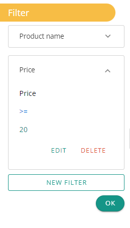
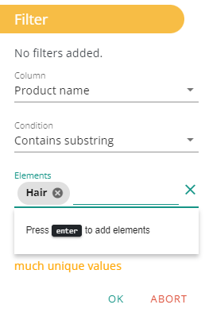
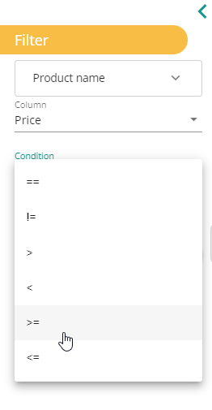

**Filter action allow you to filter data in columns.**

### Why ?

Let's say you want , from your dataset, to fetch products where the "product name" contains 'Hair' and the "price" is above $20. The filter action helps you do such tasks so you don't need to do them manualy.

### How to use it ?

By using the button "new filter" you must first choose the desired column.

Then make sure to choose the appropriate type of filter.
For text base data the currently availbalbe filters are:

As for numbers and dates:

Finally you have to add one or more elements to be used to apply the filter on the column.

A filter action holds a single filter condition on each field and works by applying a logical OR to the column data. It's possible to chain multiple filters which will be the equivalent of using a logical AND on each simillar column.

Once you have some filters applied you can see them by their column name. By clicking on it you open it and see a description of the filter.

Sometimes you can see the following error message "It seems that there are too many unique values" it means that the number of unique values in the dataset is higher than the limit set by Datama.

This was implemented to avoid application performance problems.

It has the effect of not offering the unique values in the filter value selector.
