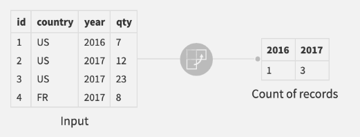
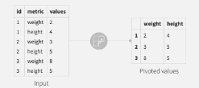
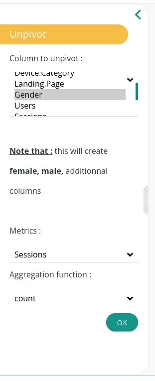
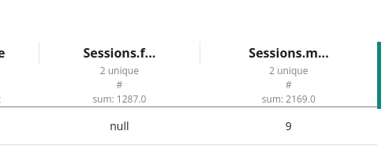

**You might want to pivot and unpivot your dataset in Datama PREP.**

What is that for?
## Pivot operations

A **pivot table** is a table of grouped values that aggregates the individual items of a more extensive table within one or more discrete categories. This summary might include sums, averages, or other statistics.

## UnPivot example

We have a column gender containing only two unique values, {males, females}.
We want to split sessions according to those values. To do so, we will unpivot the column gender using sessions as an aggregates column.

For example, this unpivot configuration creates two columns {Sessions.female and Sessions.males} containing the same values but in two distinct columns.

