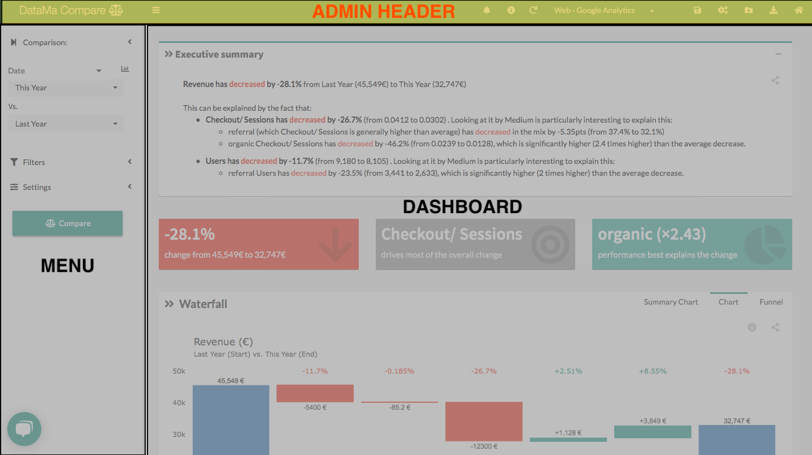

# Admin header

> See in this chapter details on the **Admin header**  available on top of DataMa interface

It allows you to:
* Switch from one solution to another
* See the recent features
* Find informations about the current use case
* Refresh Data
* Manage your saved use cases and switch from one to another
* Save the current use case
* Change metrics relation
* Create a new use case
* Export results
* Find the documentation of the solution
* Run the tutorial ...

