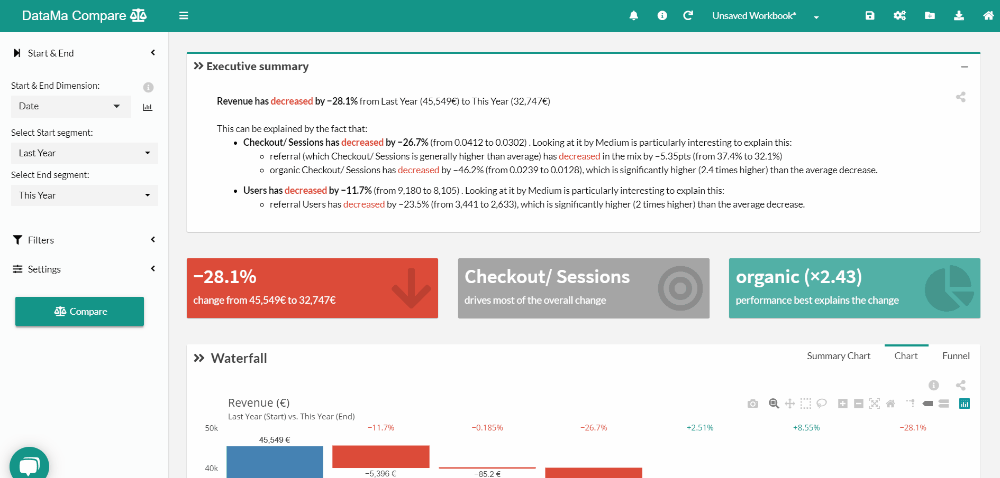
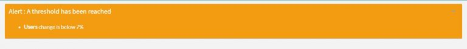

# Change metric relation

> Using **metrics relation** allows you to change your market equation, rename your step or even indicate a threshold

Once the threshold is reach, an alert will appear just below the header of the solution

Don’t forget to save your changes!
