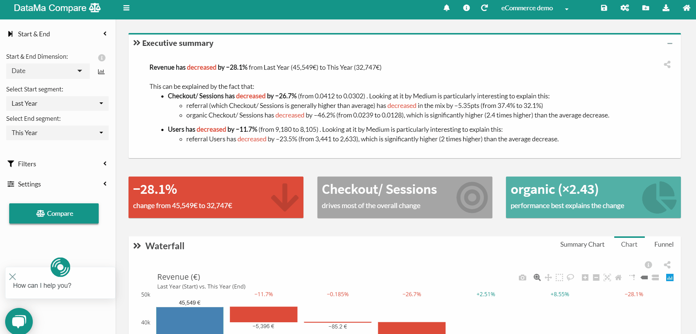

# Excel file

> In this section you will find how to upload your **Excel file**

Follow the below steps to load your Excel Data:

1. Click on « Create new use case » in the admin header
2. Select « Excel»
3. Load the Excel file from your computer. Select the right sheet and click on « Ok »
4. Check the import summary. Check dimensions and Metrics definition. Click on « next »
