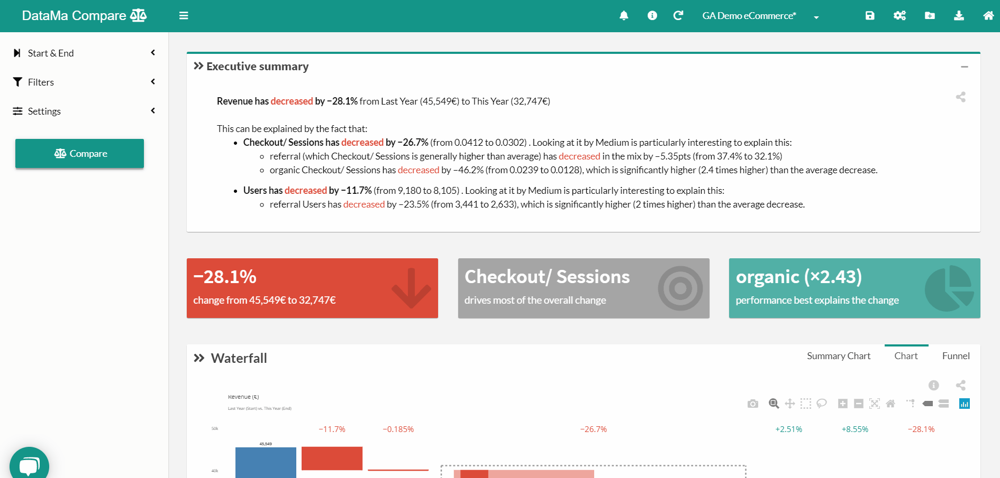

# Definitions
<!-- TBU -->

> **The Definitions Menu** (or **comparison** in DataMa COMPARE) is here to set up your analysis.

## Define what you are comparing (Compare, Impact & Journey).

**Start & End definition:** This includes both definition of the dimension you want to compare on and the segments within that dimension that defines your starting point and end point

* **Start End Dimension**: This can be whatever dimension is in your source, depending on your use case. Typically Period or Date, but also business unit, AB test variant, country…
* **Start definition**: This is really you’re starting point for the KPI you want to understand, i.e. what you want to compare to. It can be one or multiple possible values of the selected dimension.
* **End definition**: This is the end point of your waterfall, i.e. the observation of your KPI that you want to explain.
* The Start and End points represent the blue bar on the left and the right of the waterfall in COMPARE.

 

1. Select the Start & End Dimension : Date, Device, Product….
2. Then choose within the selected dimension, the segment you want to compare: 2018 and 2019, Mobile and Desktop, Product A and Product B ,….
3. Click on "Compare" (or "Impact") to get results or tap Enter

## Specify which ratio you want to assess (Pivot & Impact)

*  Define the **Numerator** and the **Denominator** of your ratio (Revenue/ Users | Purchase/ Clients | Margin/ Products...)
* In DataMa IMPACT, The Impact Metric is your main KPI. It will be the assessment metric that DataMa will calculated to make you understand the gain or the lost you’ve made.

 

