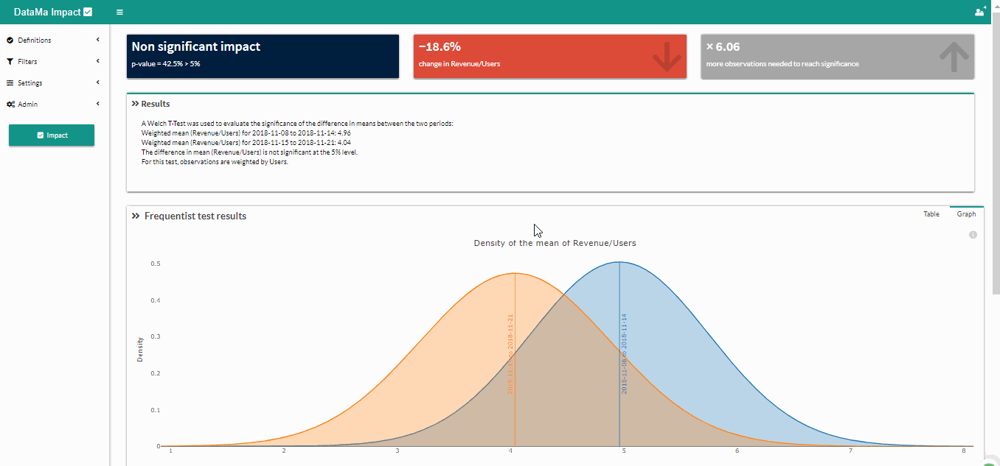

# Excluded dimensions

> **Excluded Dimensions** option allows you to **remove Dimension from the analysis**. The dimension excluded won’t appear any more in graphs.

1. Click on the drop-down arrow to display the filters menu
2. Select one or several « Excluded Dimension »
3. Click on « Compare » to get results

The selected dimensions are now excluded from the analysis.

