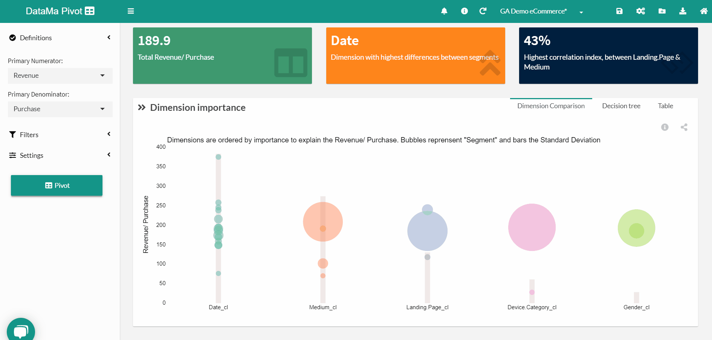

# Filters

The **filters menu** is composed of 2 options:

* Excuded dimension ( Excluded_Dimension ): Dimension you want to exclude from the analysis
* Filter segment ( Dimension_filter and Filter >/span>): Segment within a given dimension that you want to filter on

