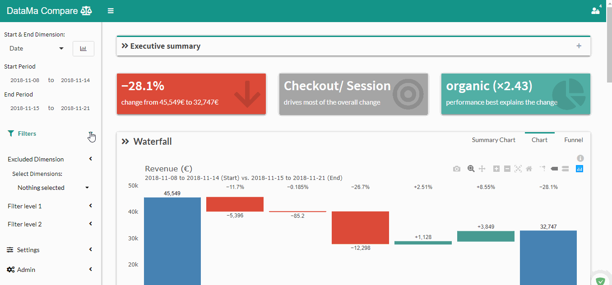

# Filters level 1 & 2

>By using **Filter**, you can choose which element within a dimension **you want to analyse**.

The unselected element will not only be removed from the analysis but also from the value.

* This mean that if you in your Device dimension you only select Desktop, all the Revenue made in Tablet, Mobile… won’t be considered any more in the analysis. (Which is a difference with Excluded Dimension filter)

1. In « Filter 1  » select the Dimension and one or several Segment you want to focus on
2. Click on « Compare » to get results

Analysis in now focused on the selected Dimension and Segment(s)
