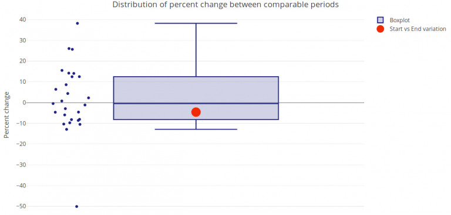

# Boxplot

Uses the boxplot rule to identify outliers.

An outlier is defined as any observation which does not lie within a range of 1.5 times the interquartile range from the quartiles.

See also: [wikipedia](https://en.wikipedia.org/wiki/Interquartile_range#Outliers)

Test data: [Gsheet](https://docs.google.com/spreadsheets/d/1VJJ2j5ldrSfvLQatd9SAikIJX_2dhBgDCjkdX_oUgB4/edit#gid=925605184)
