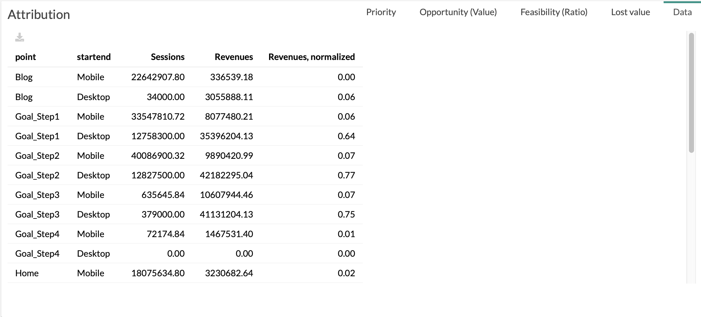

# Data

> The **Data Tab** is the table used to generate the others tabs of Attribution

With :

* **point:** name of the steps of customer journeys
* **startend:** start and end dimensions (selected in the menu)
* **Volume:** value of "Volume" (selected in the menu)
* **Value:** value of "Value" (selected in the menu)
* **Value normalized:** value of "Value" (selected in the menu) normalized.

