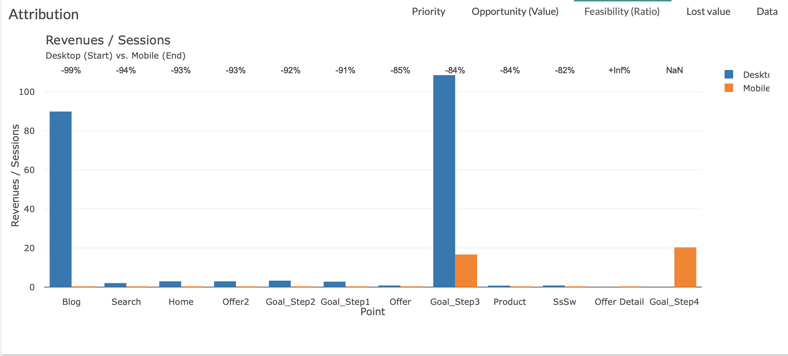

# Feasability

The Feasability tab is a graph allowing you to visualize the feasabilites (ratio) of the various steps of the customer journey.

You will be able to quickly identify the steps presenting the biggest feasability.

Two parameters are used in order to build this graph:

* X axis is [point](journey/web_application/dashboard/data.md)

* Y axis is your ratio ([Value](journey/web_application/dashboard/data.md) / [Volume](journey/web_application/dashboard/data.md) )

**Example:**

The biggest feasability  is "Goal_Step3" then "Blog" , "Goal_Step2"...