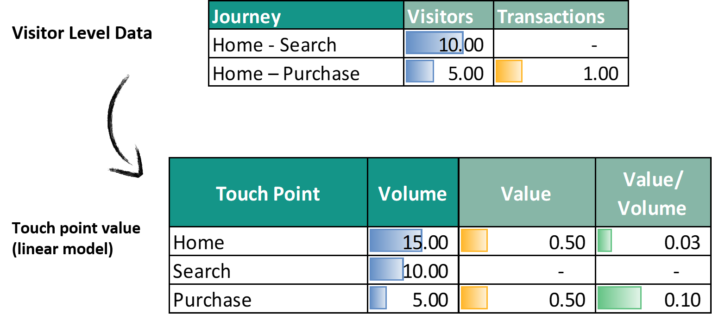
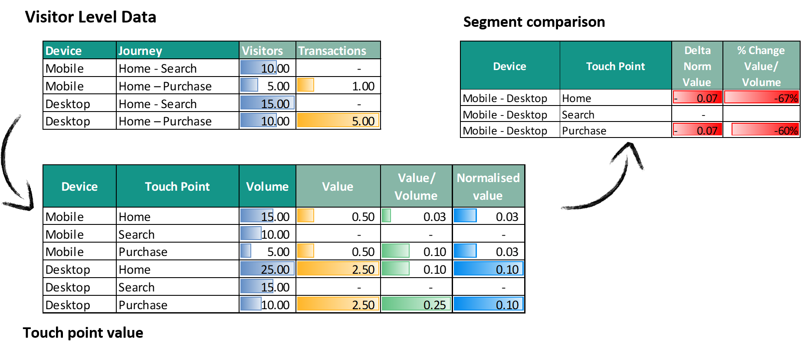

# Feasability

The Feasability tab is a graph allowing you to visualize the Value/ Volume of the various touch points of the customer journey.

You should read this ratio (value/ volume) as the value brought by a given touch point each time it's seen in journeys with value.

Steps are ranked by ratio when Compare mode is OFF, and by gap of ratio when compare mode is ON.

When Compare mode is ON, the gap of ratio % could be interpretable as the "feasibility" of reducing the gap between start and end: if the gap is big, it's probably easier to reduce this gap by improving the experience of users on the considered touch point for the lower segment, since it seems feasible (based on the other Start End segment benchmark) to have a higher ratio.

You will be able to quickly identify the steps presenting the biggest feasability.

**Example:**

The biggest feasability  is "Goal_Step3" then "Blog" , "Goal_Step2"...

Two parameters are used in order to build this graph:

* X axis is [point](journey/web_application/dashboard/data.md)

* Y axis is your ratio ([Value](journey/web_application/dashboard/data.md) / [Volume](journey/web_application/dashboard/data.md) )
