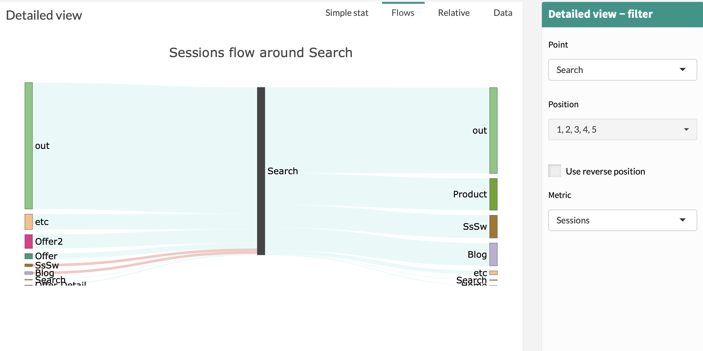

# Flow

The Flow tab is a graph allowing you to visualize previous point and next point for a choosen step (Point in Detailed View Filter) on a choosen metric (Metric in Detailed View Filter).

If Compare Mode is activated then End Dimension will be represented.
Green represents positive variation between Start and End while red represents negative variation between Start and End.

The size of the flow shown is related to the percentage of the metric

**Example:**

