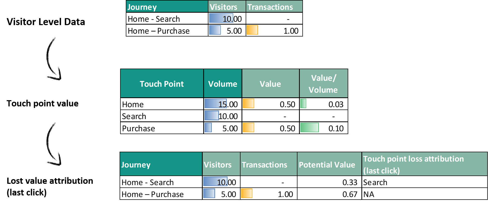

# Lost Value

The Lost tab is a graph allowing you to visualize the lost value (simulated) of the various steps of the customer journey.

The lost value is computed on Journeys that bring no value. For each non valuable journey, a "theoretical value" is computed based on the selected attribution model and previously computed [value](journey/web_application/dashboard/feasibility.md) of each touch point, and this theoretical value is considered as lost due to the last touch point of the considered journey.

You will be able to quickly identify the steps presenting the biggest lost.

Two parameters are used in order to build this graph:

* X axis is [point](journey/web_application/dashboard/data.md)

* Y axis is lost [values](journey/web_application/dashboard/data.md)

**Example:**

The biggest lost  is "Goal_Step2" then "Search" , "Offer"...
