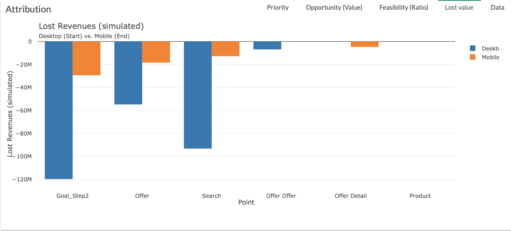
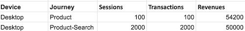

# Lost Value

The Feasability tab is a graph allowing you to visualize the lost value (simulated) of the various steps of the customer journey.

You will be able to quickly identify the steps presenting the biggest lost.

Two parameters are used in order to build this graph:

* X axis is [point](journey/web_application/dashboard/data.md)

* Y axis is lost [values](journey/web_application/dashboard/data.md)

**Example:**

The biggest lost  is "Goal_Step2" then "Search" , "Offer"...

**Lost Value:**

Lost value is the sum of losses due to the point.

There is a loss on a point when adding this point to a customer journey causes a loss of value (here Revenue).

The loss here is 4200.