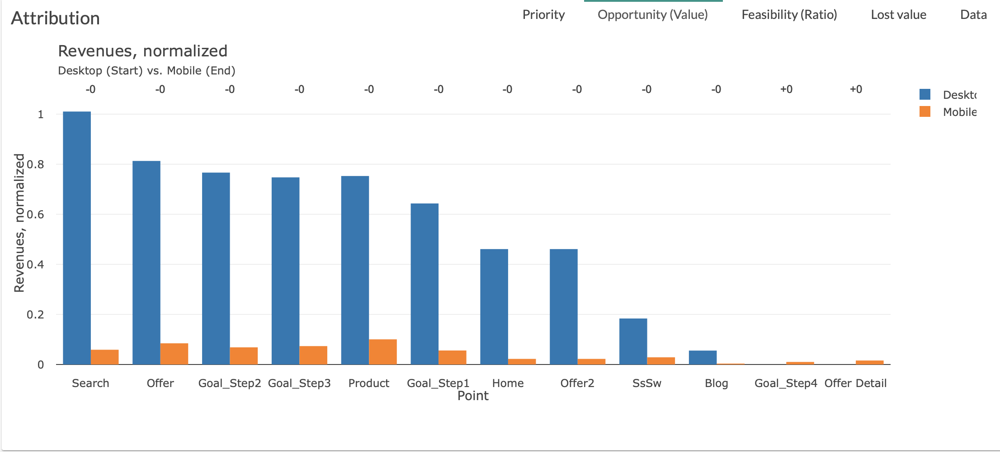

# Opportunity

The Opportunity tab is a graph allowing you to visualize the opportunities of the various steps of the customer journey.

You will be able to quickly identify the steps presenting the biggest opportunity thanks to our decreasing ranking.

Two parameters are used in order to build this graph:

* X axis is [point](journey/web_application/dashboard/data.md)

* Y axis is your [value](journey/web_application/dashboard/data.md)

**Example:**

The biggest opportunity  is "Search" then "Offer" , "Goal_Step2"...
