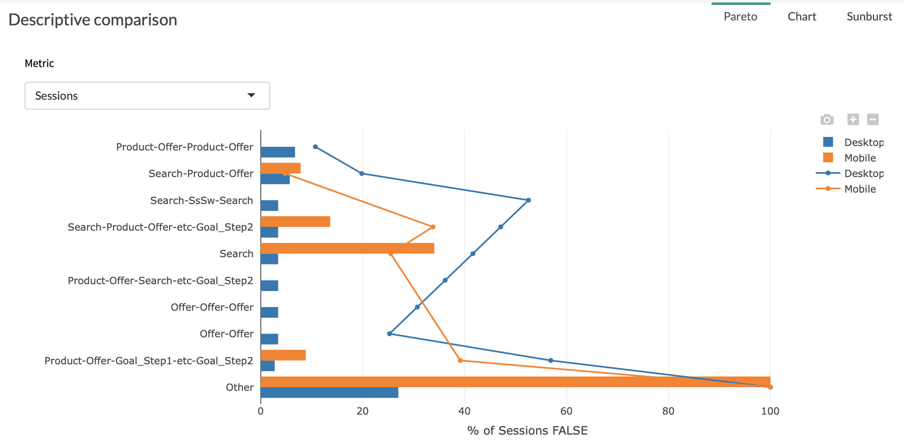

# Pareto

The Pareto tab is a graph allowing you to visualize the repartition of your metric in the various steps of the customer journey.

You will be able to quickly identify the steps representing the highest volumes thanks to our decreasing ranking.

Two parameters are used in order to build this graph:

* X axis is % of the metric you have chosen

* Y axis is [point](journey/web_application/dashboard/data.md)

**Example:**

