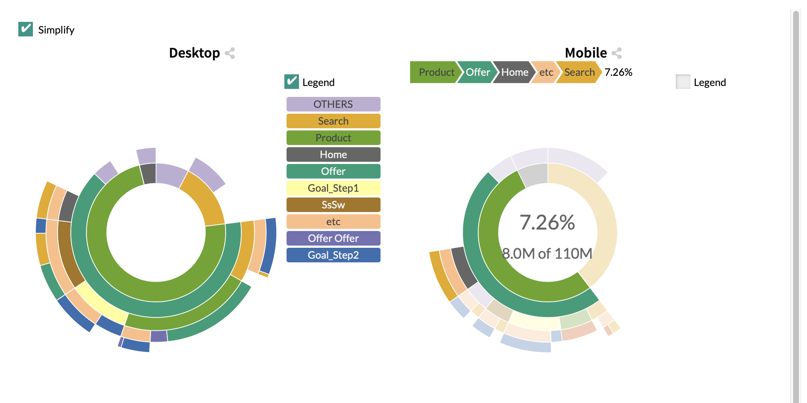

# Sunburst

The Sunburst tab is a tab in two parts

* Start End Sunbursts

* Similarity Index Sunburst

**Start End Sunbursts:**

We use sunburst to represent the various customer journeys and their frequency of appearance (size of slices)  in your source.

The left one is your Start dimension.

The right one is your End dimension.

**Similarity Sunburst:**

This sunburst represents the differences in appearance of the various journeys between Start and End dimensions

