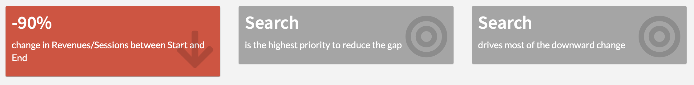

# Value Boxes

> Value boxes intends to give you an **executive summary of your analysis**. It is split in 3 boxes

1. The overall change in % between your global feasability from Start to End.
2. The first step you need to focus on in order to reduce significantly the gap.
3. Within the step that drives most of the gap, either:
    * The name of the segment which’s performance drives most of the gap
    * The name of the dimension which’s mix effect drives most of the gap