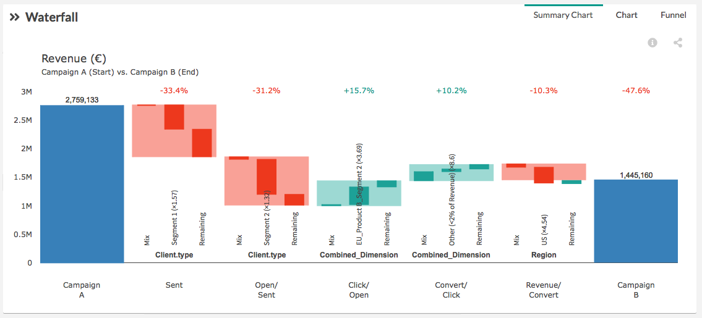

# Summary view

The **summary view** shows the main information on how the dimension contributes to the variation of the performance between start and end in a given step. Each step is split in three: Mix effect (1) main performance effect (2), and remaining (3).

(1) **Mix effect:** contribution to the performance due to the evolution of the breakdown in input. (read more about [mix effect](compare/web_application/dashboard/mix_effect.md)) (e.g.: more mobile traffic in percentage of the total traffic will cause a negative mix effect – the evolution of the composition of the traffic will have a negative impact – indeed if mobile traffic converts less than desktop traffic which is generally the case)

(2) **Main performance effect:** only one element of the main dimension is displayed in the graph. The selected dimension is scored and selected because considered as the most interesting to follow. (e.g. if the main dimension is device category, we will select the main element within this category: Desktop for example)

* Dimension selection is based on "credit" logic between mix and performance calculations
* Dimension selection is intended to help decision taking and fasten dashboard readability – that doesn’t mean that other dimensions are not important

(3) **Remaining:** sum of the other elements contribution from the dimension selected in the performance effect (2). (e.g.: using the same example as in (2) the remaining element of the Device category will be Mobile and Tablet.)

