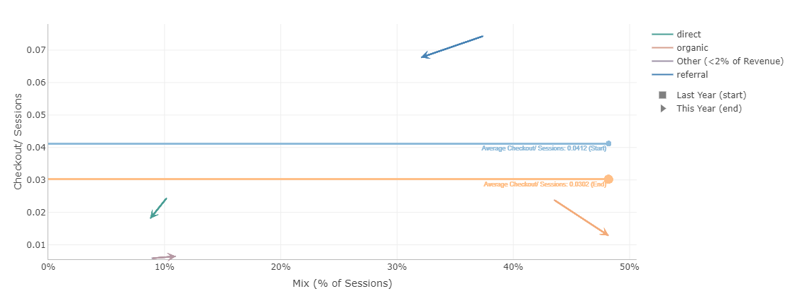

# Detailed View

> **« Detailed View »** allows you to deep dive on each step and each dimension.

By default, the drop-down menus are selected in both main step and main dimension of your analysis. You can change the selection of either a step or a dimension. Each time you run the calculation, the default selection in the drop-down menu will be reactivated.

The selection is dynamic: selection made on the « Detailed view – filter » will affect the waterfall above.

3 different views are available for this « detailed view »:
* [Moves](compare/web_application/dashboard/moves.md)
* [Bridge](compare/web_application/dashboard/bridge.md)
* [Detailed bridge](compare/web_application/dashboard/detailed_bridge.md)
