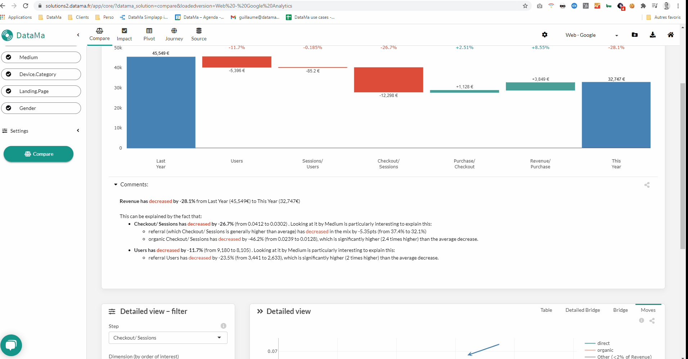

# Zoomed view

**Zoomed view** is opened when clicking on one step of the overall waterfall chart

* Click on one step to open the detail behind one variation
* By default, most interesting dimension is displayed, but you can force to show another dimension effect by changing the value in the detailed view filter section
* Unzoom by clicking on another step, or on a total blue bar

