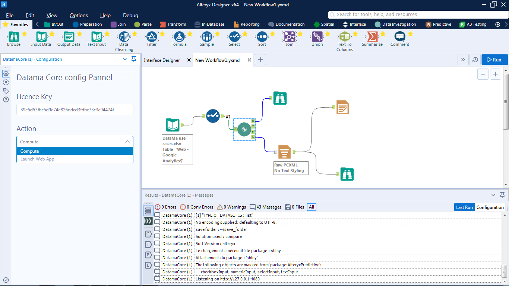

# Alteryx extension

> DataMa can be run as a **Alteryx plugin**, to use both the R library and the Shiny web app in an Alteryx environment.

Contact us (contact@datama.fr) to get a licence key and install the module

Below screenshot is a good preview of what to expect

