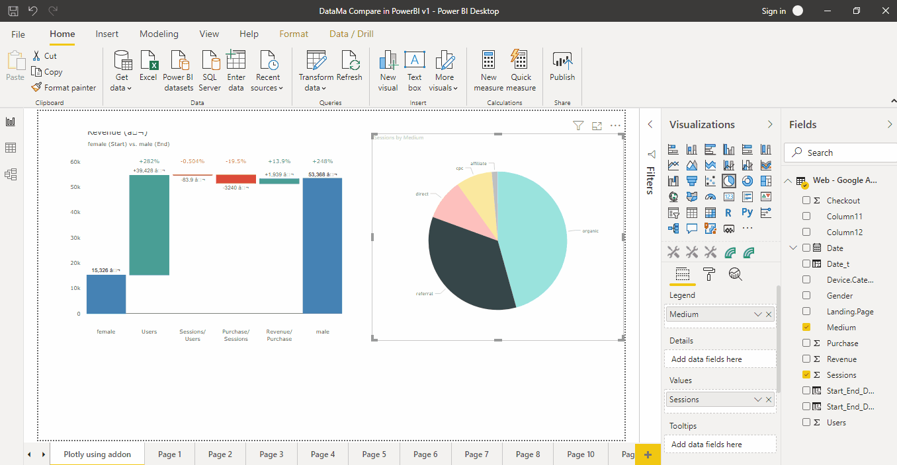

# PowerBI extension

> DataMa can be run as a **PowerBI plugin**, to use both the R library and the Shiny web app in a PowerBI environment.

Contact us (contact@datama.fr) to get a licence key and install the module

Below is a good preview of what to expect

