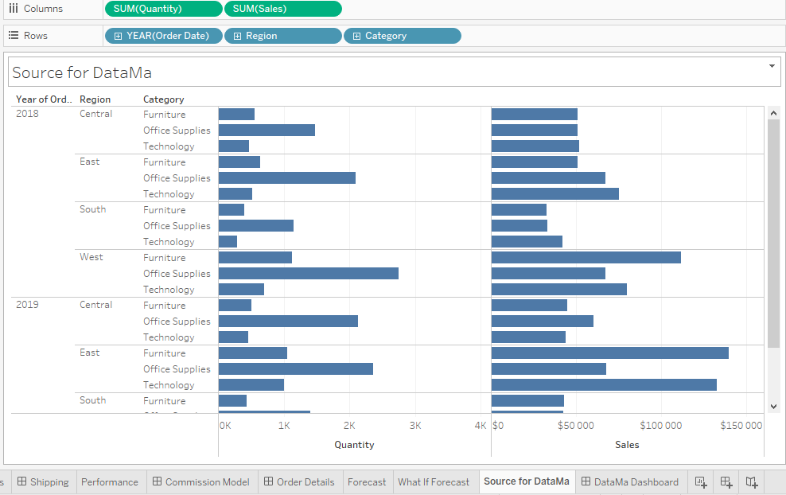
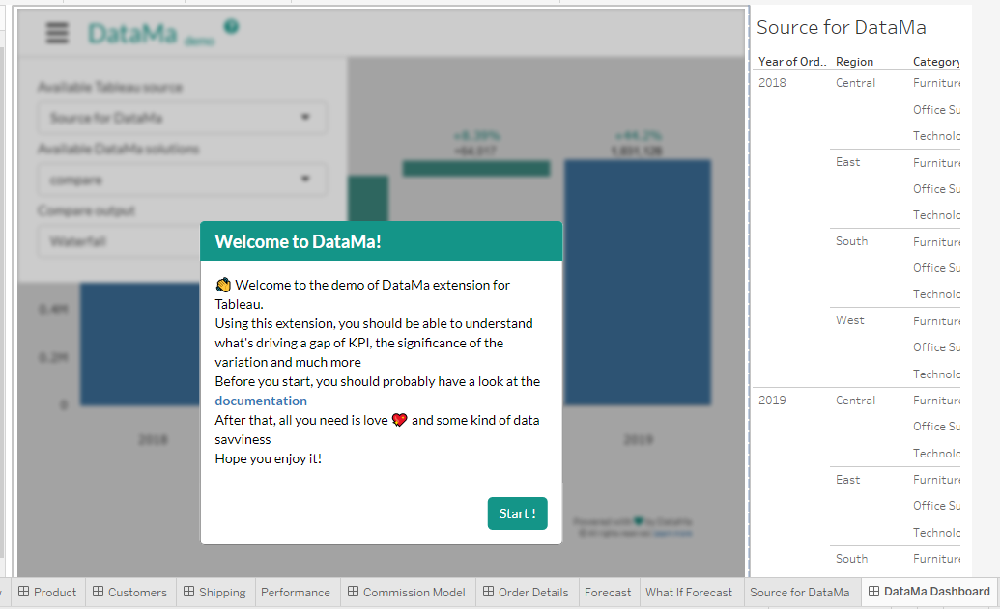
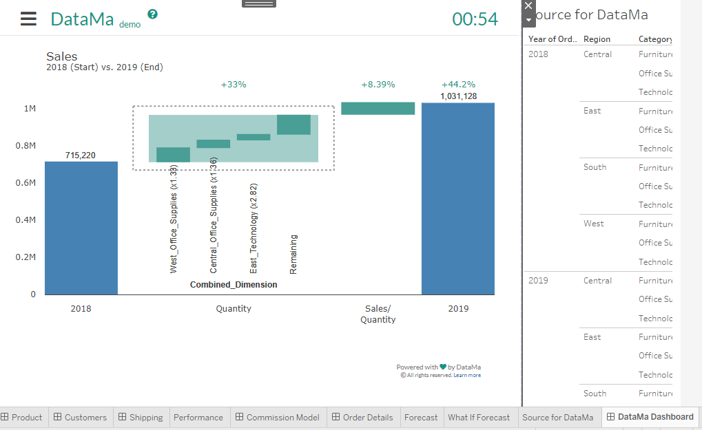
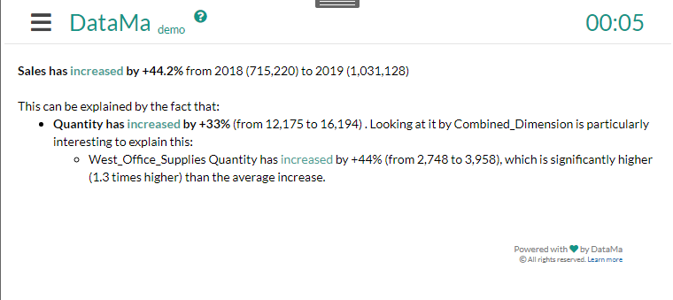

# Tableau extension demo

> Tableau extension demo is an introduction to DataMa analysis limited in time and capacity. You may want to contact us for getting fully up to speed

DataMa helps you do the job of an advanced data analyst faster, in Tableau.
It's particularly helpful for marketing analysis, such has gap/ root cause analysis.
Using this extension you will have access to
* Waterfall analysis using [DataMa Compare](/compare/compare.md)
* Significance analysis using [DataMa Impact](/impact/impact.md)
* Driver analysis using [DataMa Pivot](/impact/impact.md)

Below is a step by step on how to get it working in tableau

## 1. Create a source worksheet

In Tableau Desktop, create a new worksheet a source for DataMa.

A source worksheet should have all the metrics and dimensions you want to analyse in DataMa.
Typically a source for DataMa will have
* A set of dimensions in Rows
  * The dimension you want to compare on should come first
* A set of metrics in columns
  * The metrics should come in alphabetical order, so that DataMa automatically creates the right [Metric relation](/general/admin/input/metric_relation).
    Adding a "1_..", "2_.." in the naming of your metrics should help in that regard

Here is an example of a source from The SuperStore default dataset of Tableau.

Please refer to the full documentation to learn more about [sources](/general/admin/input/source) or see [example of use cases](/home/use_cases/use_cases_examples)

## 2. Insert the DataMa extension in a dashboard

* Download the DataMa demo Tableau extension .trex file. It is available on the [Tableau Gallery](https://extensiongallery.tableau.com/extensions).
* In Tableau desktop, create a dashboard, and add your worksheet to this dashboard
* Drag and drop 'extension' Object in your dashboard and select the .trex file you just downloaded
* Click 'Start' at the bottom of the welcome modal when it appears

Here is an example of a source from The SuperStore default dataset of Tableau.

## 3. Get insights

By default, DataMa brings you in DataMa compare and shows a waterfall analysis, which is interactive (by clicking on the steps of the funnel)
You can switch DataMa solution and visualisation using the top left menu
We encourage that you read the documentation about each solution to understand what's in there and how it works.

* Waterfall analysis using [DataMa Compare](/compare/compare.md)
* Significance analysis using [DataMa Impact](/impact/impact.md)
* Driver analysis using [DataMa Pivot](/impact/impact.md)

### Example of Compare analysis for the SuperStore default dataset of Tableau.

In a glimpse, we get the waterfall that explains the gap of Sales between 2018 and 2019, driven by quantity increase and in particular the one of Office Supplies in the west, as we can read by selecting the 'Executive Summary' in the output menu.

### Example of Compare analysis for Digital display campaigns

<iframe width="560" height="315" src="https://www.youtube.com/embed/OaoVK166Bl0" frameborder="0" allow="accelerometer; autoplay; clipboard-write; encrypted-media; gyroscope; picture-in-picture" allowfullscreen></iframe>
