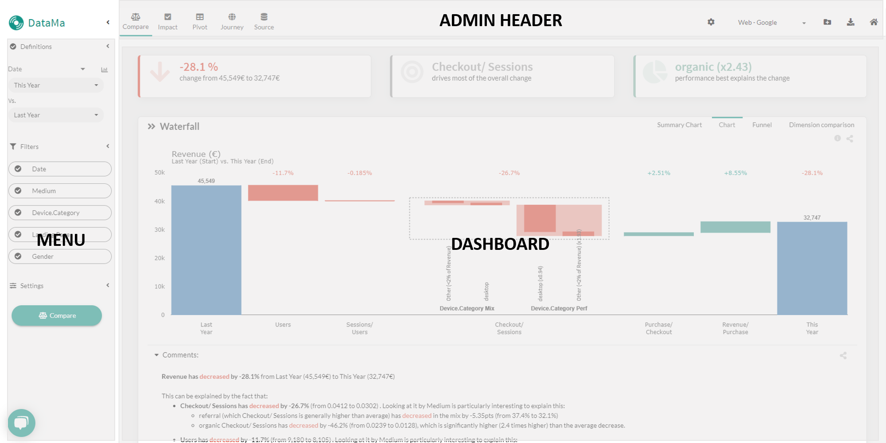

# Core app

> This section of the documentation should allow you to get to understand **how to use and get value of DataMa**.

The core workbook app interface is split in three main parts:

* **Admin Header:** the header of the window manage your account and your use cases [Learn More](general/admin/admin)
* **Dashboard:**  essentially the charts you see in the page, produced by DataMa Solutions
 * [DataMa Compare](compare/compare.md)
 * [DataMa Impact](impact/impact.md)
 * [DataMa Pivot](pivot/pivot.md)
 * [DataMa Journey](journey/journey.md)
 * [DataMa Source](source/source.md)
* **Menu:** The left part of the web page, which allows you to interact with the model [Learn More](general/menu/menu)
