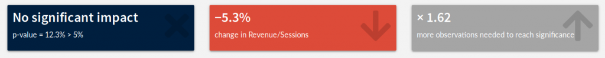
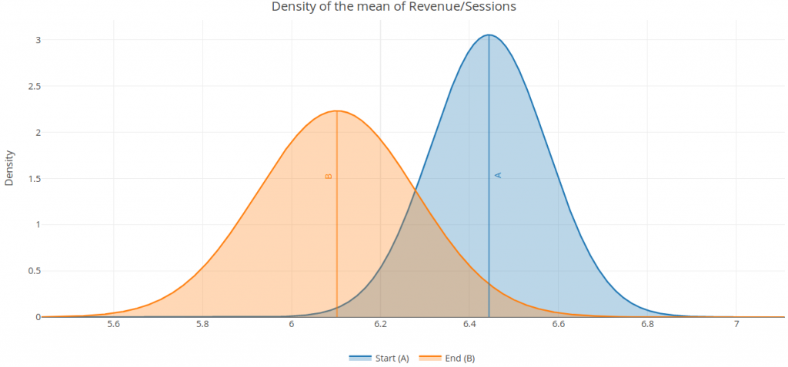

# Frequentist (other)

In the frequentist approach, the outcome can be any variable. However, the data should be either unaggregated, or aggregated in comparable groups.

If the outcome variable is binary and data is aggregated, the Frequentist (Bernoulli) test should be used instead (for a precious gain of statistical power).

**Behind the scenes:** A frequentist Welch t-test is computed to test whether the mean outcome is significantly different between the *Start period* and the *End period*. The standard deviation used in the test is derived from the properties of the sample (from the sample variance).

See also: [wikipedia](https://en.wikipedia.org/wiki/Welch’s_t-test)

Test data: [Gsheet](https://docs.google.com/spreadsheets/d/1VJJ2j5ldrSfvLQatd9SAikIJX_2dhBgDCjkdX_oUgB4/edit#gid=0)
