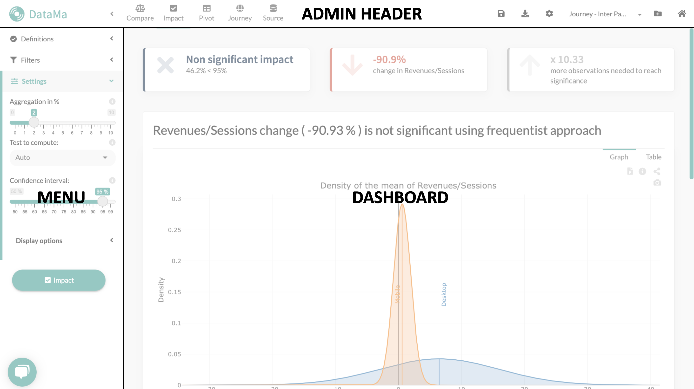

# Web application

The interface is split in three main parts:

* **Admin Header:** the header of the window manage your account and your use cases
* **Dashboard:**  essentially the charts you see in the page
* **Menu:** The left part of the web page, which allows you to interact with the model

