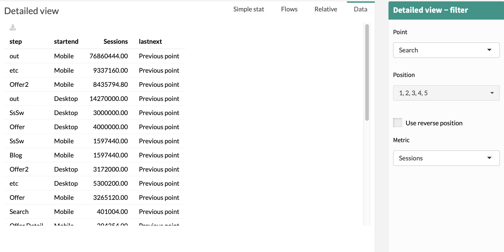

# Data

> The **Data Tab** is the table used to generate the others tabs of Detailed View.

With :

* **step:** name of the steps of customer journeys
* **startend:** start and end dimensions (selected in the menu)
* **Volume:** value of "Volume" (selected in the menu)
* **lastnext:** information used to create Flow

