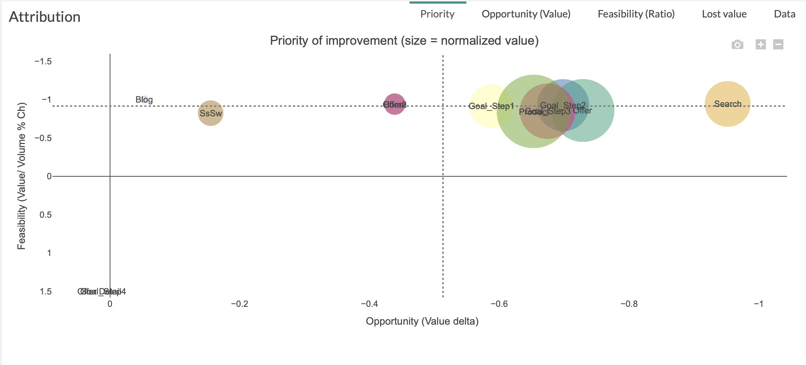
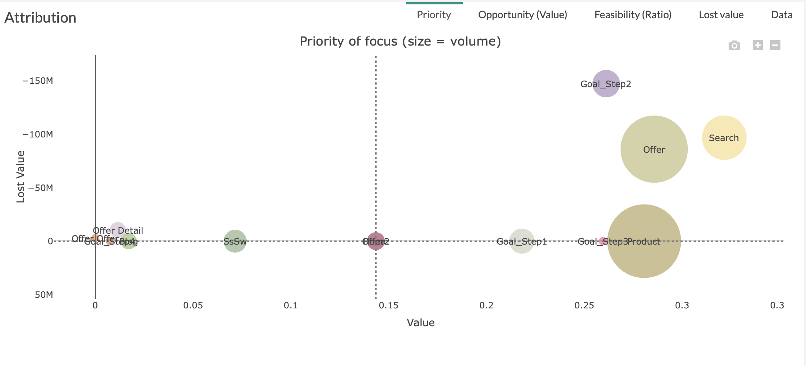

The Priority tab  is a graph allowing you to visualize the steps of your customers' journeys to improve first.

# Priority with Compare Mode

Three parameters are used in order to build this graph:

* X axis is  [feasability](journey/web_application/dashboard/feasability.md)

* Y axis is  [opportunity](journey/web_application/dashboard/opportunity.md)

* The size of the circles is  [normalized value](journey/web_application/dashboard/data.md)

**Example:**

Here, the first step to improve is "Search" because it has  the highest feasibility ([Ratio](journey/web_application/dashboard/data.md)) and opportunity ([Value](journey/web_application/dashboard/data.md)).

# Priority without Compare Mode

Three parameters are used in order to build this graph:

* X axis is  [opportunity](journey/web_application/dashboard/opportunity.md)

* Y axis is  [lost value](journey/web_application/dashboard/lost_value.md)

* The size of the circles is  [normalized value](journey/web_application/dashboard/data.md)

**Example:**

Here, the first step to improve is "Goal_Step2" because it has a relatively low [opportunity](journey/web_application/dashboard/opportunity.md) for the lowest [lost value](journey/web_application/dashboard/lost_value.md).
