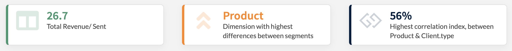

# Value boxes

> Value boxes intends to give you an **executive summary of your analysis**. It is split in 3 boxes

1. The mean of the selected KPI on the overall dimension
2. The most important dimension in your dataset to follow the selected KPI.
3. The highest correlation in your dataset
